# AKS GitOps Platform

An extensible Kubernetes platform on Azure, built with Terraform and Argo CD. Once the foundation is in place, new applications can be deployed by adding manifests to Git, while platform components can be added through Helm chart configuration.

## Key Features

- **Extend through Git** — ApplicationSets discover new application directories and platform configurations automatically.
- **Clear ownership** — Terraform provisions Azure infrastructure and bootstraps Argo CD; Argo CD manages platform services and workloads.
- **Shared platform capabilities** — Applications reuse ingress routing, automated DNS, TLS certificates, and resource monitoring.
- **Continuous reconciliation** — Automated sync, self-healing, and pruning keep Kubernetes resources aligned with Git.
- **Identity-based Azure access** — AKS pulls private images through managed identity, while ExternalDNS updates Azure DNS through Workload Identity.

The walkthrough below rebuilds the platform from scratch and documents each stage with commands and screenshots from the deployed environment.

## Architecture

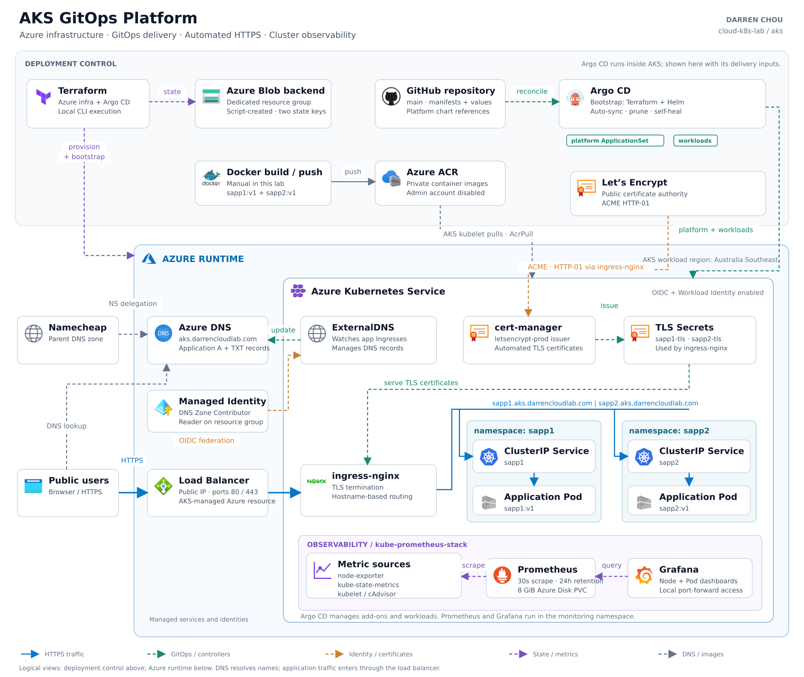

## 1. Create the Terraform Backend

Create a dedicated Azure Storage account and blob container to store Terraform state.

Run the following commands from the `aks/` directory in WSL:

```bash
# Log in to Azure
az login

# Create the Terraform backend
bash scripts/00-bootstrap-tf-backend.sh
```

See [backend bootstrap script](scripts/00-bootstrap-tf-backend.sh).

In production, Terraform backends are typically provisioned and managed centrally. This lab uses a separate bootstrap script to simulate that process.

The bootstrap script creates the backend resources and generates the Terraform backend configuration.

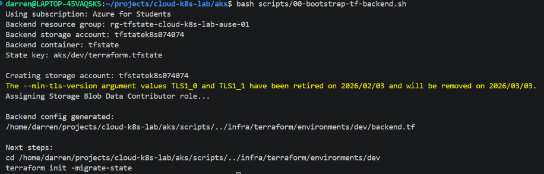

The dedicated storage account contains the `tfstate` container for Terraform state.

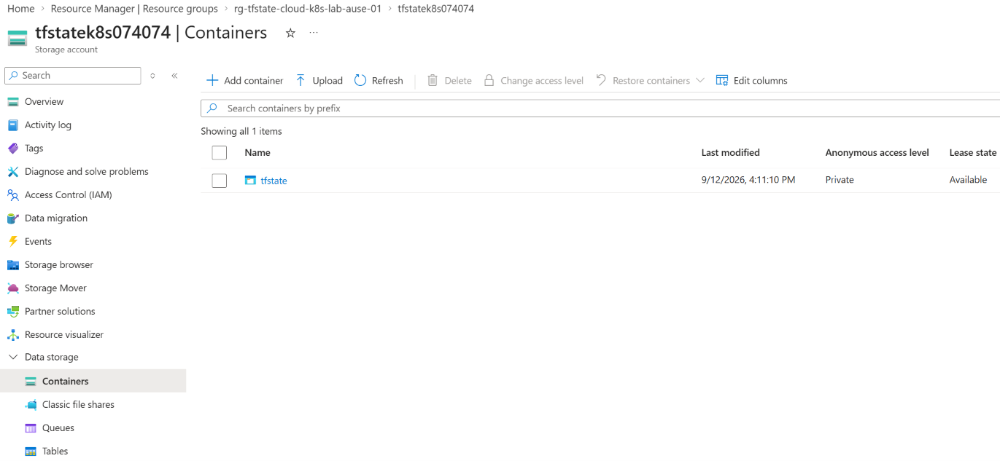

## 2. Deploy Azure Infrastructure

Provision AKS, ACR, Azure DNS, and the managed identities and permissions required by the platform.

```bash
# Enter the Terraform infrastructure directory from aks/
cd infra/terraform/environments/dev

# Set the Azure subscription
export TF_VAR_subscription_id=$(az account show --query id -o tsv)

# Initialize Terraform with the remote backend
terraform init

# Validate the configuration
terraform validate

# Preview infrastructure changes
terraform plan -out=tfplan

# Deploy the reviewed plan
terraform apply tfplan
```

In production, Terraform changes typically run through a CI/CD pipeline with pull request review, automated validation and planning, and approval before apply. This lab runs these commands locally against a remote backend.

See [environment configuration](infra/terraform/environments/dev/main.tf) and [infrastructure module](infra/terraform/modules/main.tf).

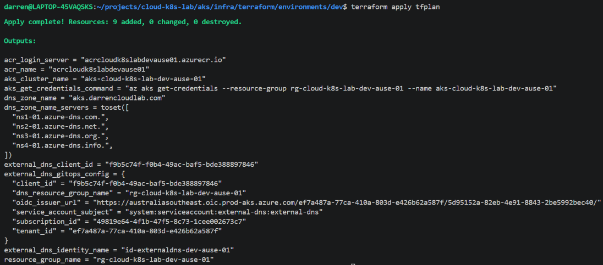

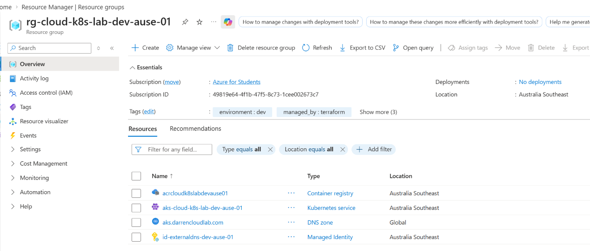

## 3. Delegate the Subdomain to Azure DNS

Delegate `aks.darrencloudlab.com` to Azure DNS so ExternalDNS can manage application DNS records.

```bash
# Show the Azure DNS nameservers from the infrastructure directory
terraform output dns_zone_name_servers
```

In Namecheap, open **Advanced DNS → Host Records** for `darrencloudlab.com`. Add four **NS records** with `aks` as the host, using the nameservers returned above.

The existing records already match this deployment, so no changes are needed.

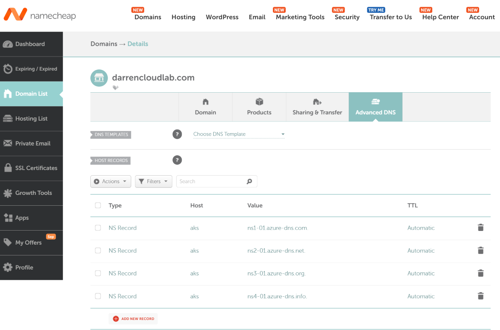

```bash
# Verify the subdomain nameservers
dig NS aks.darrencloudlab.com +short
```

The response should list the same four Azure nameservers. If the Azure DNS zone is recreated, check that the delegation still matches its assigned nameservers.

## 4. Build and Push Application Images

Build the two demo applications and push their images to ACR before Argo CD deploys the workloads.

Run the following commands from the `aks/` directory:

```bash
# Read the registry details from Terraform outputs
ACR_NAME=$(terraform -chdir=infra/terraform/environments/dev output -raw acr_name)
ACR_SERVER=$(terraform -chdir=infra/terraform/environments/dev output -raw acr_login_server)

# Log in to ACR
az acr login --name "$ACR_NAME"

# Build the application images
docker build -t "$ACR_SERVER/sapp1:v1" app/sapp1
docker build -t "$ACR_SERVER/sapp2:v1" app/sapp2

# Push the images to ACR
docker push "$ACR_SERVER/sapp1:v1"
docker push "$ACR_SERVER/sapp2:v1"

# Verify the published image tags
az acr repository show-tags --name "$ACR_NAME" --repository sapp1 -o table
az acr repository show-tags --name "$ACR_NAME" --repository sapp2 -o table
```

In production, application teams typically own container images, with CI pipelines building and pushing them to ACR. This lab builds and pushes images manually; Argo CD handles deployment from Git.

See [application source and Dockerfiles](app/).

Both images use the `v1` tag referenced by the GitOps deployment manifests.

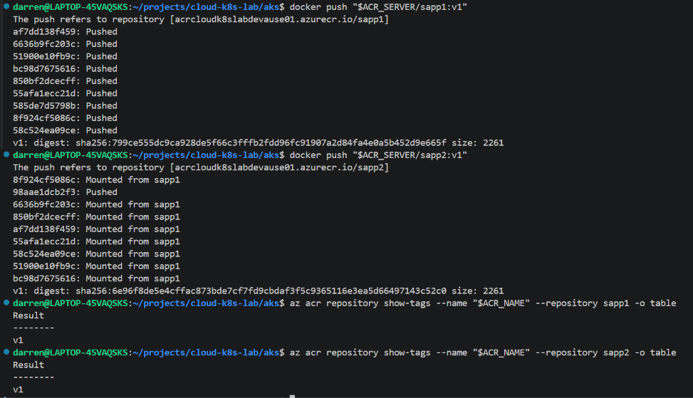

## 5. Bootstrap Argo CD and Deploy the Platform

Bootstrap Argo CD with Terraform. Two ApplicationSets then discover and deploy the platform components and application workloads from Git.

Before bootstrapping, update `serviceAccount.annotations.azure.workload.identity/client-id` in [ExternalDNS values](gitops/platform/external-dns/values.yaml) with the current Terraform `external_dns_client_id` output, then commit and push to `main`. Recreating the managed identity changes its client ID.

Run the following commands from the `aks/` directory:


```bash
# Enter the Argo CD bootstrap directory
cd infra/terraform/bootstrap/dev

# Set the Azure subscription for the Terraform provider
export ARM_SUBSCRIPTION_ID=$(az account show --query id -o tsv)

# Initialize and validate the bootstrap configuration
terraform init
terraform validate

# Review and deploy the Argo CD bootstrap
terraform plan -out=tfplan
terraform apply tfplan

# Connect kubectl to AKS
az aks get-credentials \
  --resource-group rg-cloud-k8s-lab-dev-ause-01 \
  --name aks-cloud-k8s-lab-dev-ause-01 \
  --overwrite-existing

# Check application sync and health status
kubectl get applications -n argocd
```

See [Terraform bootstrap](infra/terraform/bootstrap/dev/argocd.tf) and [ApplicationSet configuration](infra/terraform/bootstrap/dev/argocd-apps-values.yaml).

Terraform installs Argo CD and the ApplicationSets. Argo CD then reconciles ingress-nginx, cert-manager, ExternalDNS, kube-prometheus-stack, sapp1, and sapp2 from Git.

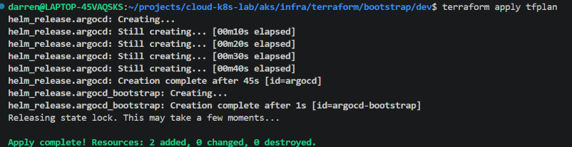

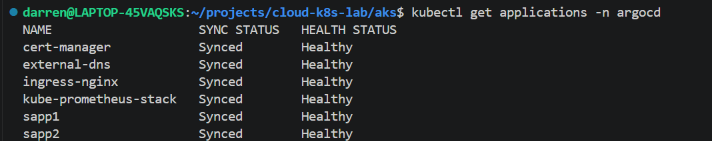


## 6. View the GitOps Deployment in Argo CD

Argo CD provides a central view of the four platform components and two application workloads. All six applications are synced with their configured sources and healthy.

```bash
# Open local access to the Argo CD UI
kubectl port-forward -n argocd svc/argocd-server 8080:443

# Retrieve the initial Argo CD admin password
kubectl get secret argocd-initial-admin-secret -n argocd \
  -o jsonpath='{.data.password}' | base64 --decode
```

Open https://localhost:8080 and sign in to view the Applications dashboard.

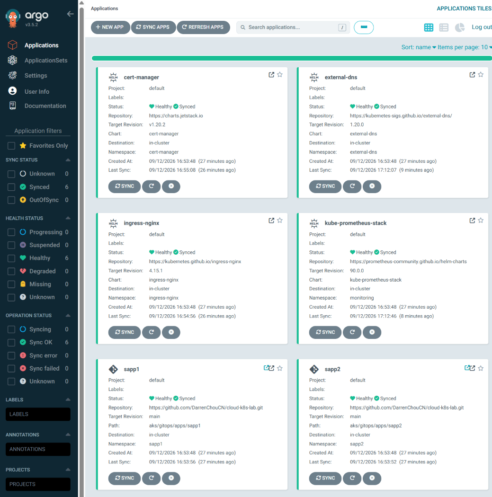

## 7. Verify the Public Ingress

ingress-nginx provides a shared public entry point for both applications, with separate hostnames configured through Kubernetes Ingress resources.

```bash
# Show the public ingress endpoint
kubectl get svc ingress-nginx-controller -n ingress-nginx

# Show application hostnames and ingress addresses
kubectl get ingress -A
```

Both application Ingresses use the `nginx` IngressClass and share the controller's external IP.

See [sapp1 Ingress](gitops/apps/sapp1/ingress.yaml) and [sapp2 Ingress](gitops/apps/sapp2/ingress.yaml).

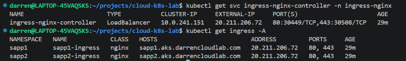


## 8. Verify Automated DNS Records

ExternalDNS creates application DNS records in Azure DNS from Kubernetes Ingress resources, authenticating through Azure Workload Identity.

```bash
# Check public DNS resolution for both applications
dig sapp1.aks.darrencloudlab.com +short
dig sapp2.aks.darrencloudlab.com +short
```

Both hostnames should resolve to the ingress controller's public IP. Companion TXT records track ExternalDNS ownership.

See [ExternalDNS configuration](gitops/platform/external-dns/values.yaml).

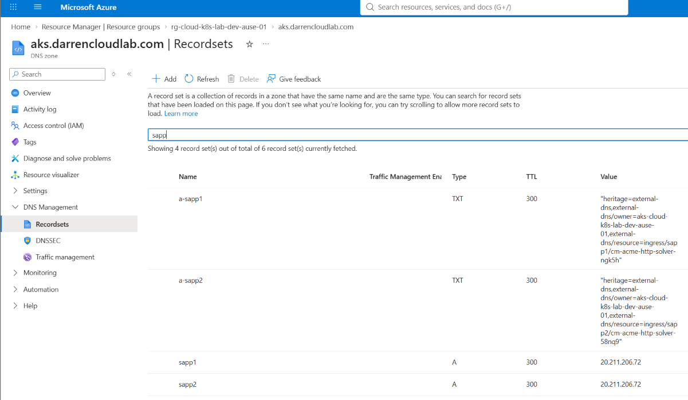

## 9. Verify TLS Certificates and HTTPS Access

cert-manager provisions Let's Encrypt certificates for both applications. ingress-nginx uses these certificates to serve HTTPS traffic.

```bash
# Check certificate readiness for both applications
kubectl get certificates -n sapp1
kubectl get certificates -n sapp2
```

Both certificates report `READY=True`.

See [Let's Encrypt ClusterIssuer](gitops/platform/cert-manager/manifests/clusterissuer-letsencrypt.yaml).

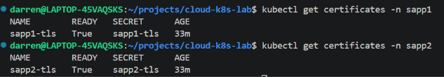

The applications are accessible through their public HTTPS endpoints:

- [sapp1](https://sapp1.aks.darrencloudlab.com)
- [sapp2](https://sapp2.aks.darrencloudlab.com)

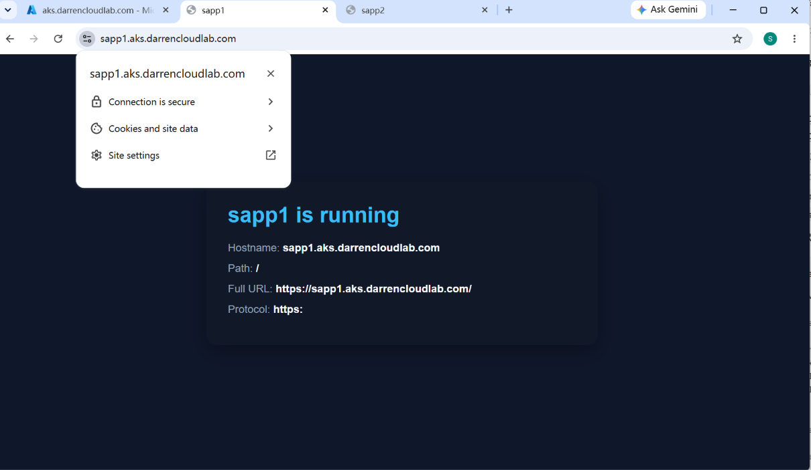

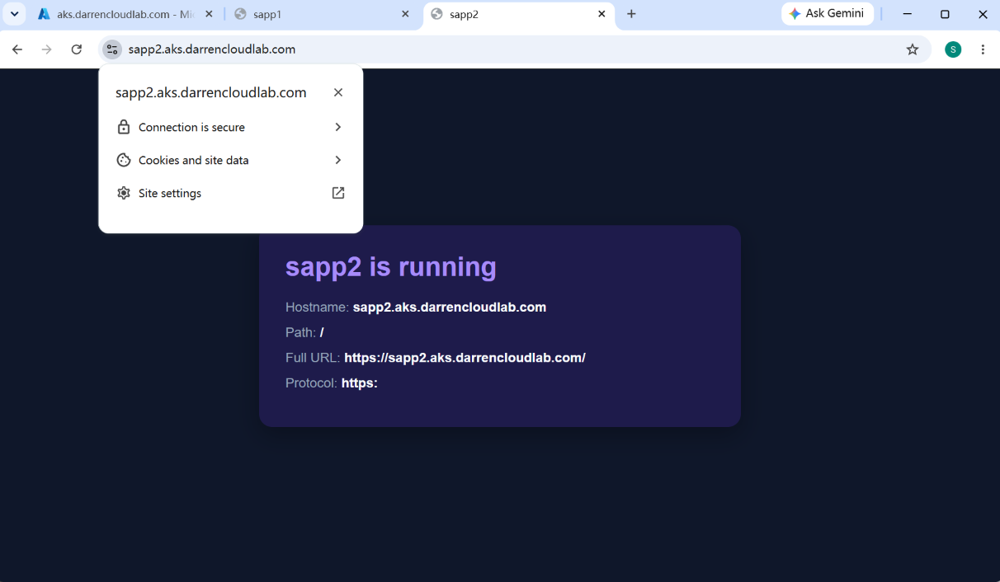

## 10. Monitor Node and Application Resources

Prometheus collects cluster metrics, while Grafana dashboards display node and application resource usage.

```bash
# Check monitoring workloads and persistent volume claims
kubectl get pods,pvc -n monitoring

# Open local access to Grafana
kubectl port-forward -n monitoring svc/kube-prometheus-stack-grafana 3000:80

# Retrieve the Grafana admin password
kubectl get secret -n monitoring kube-prometheus-stack-grafana \
  -o jsonpath='{.data.admin-password}' | base64 --decode
```

Open http://localhost:3000 and sign in to Grafana.

See [monitoring configuration](gitops/platform/kube-prometheus-stack/values.yaml).

The **Node Exporter / Nodes** dashboard shows node CPU, memory, disk, and network metrics.

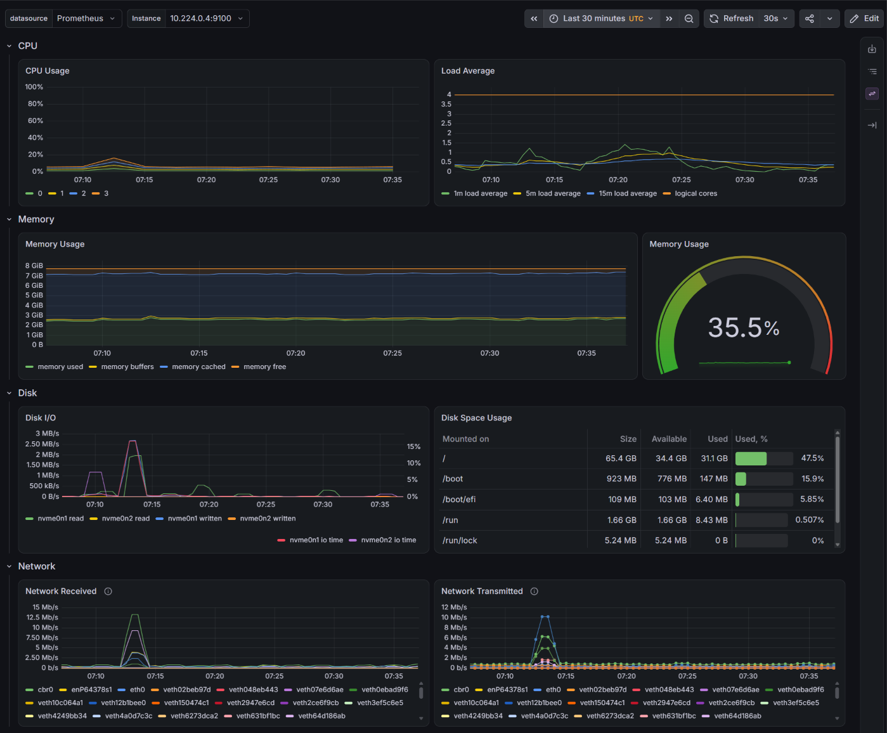

The **Kubernetes / Compute Resources / Pod** dashboard shows CPU, memory, and network usage for the `sapp1` workload.

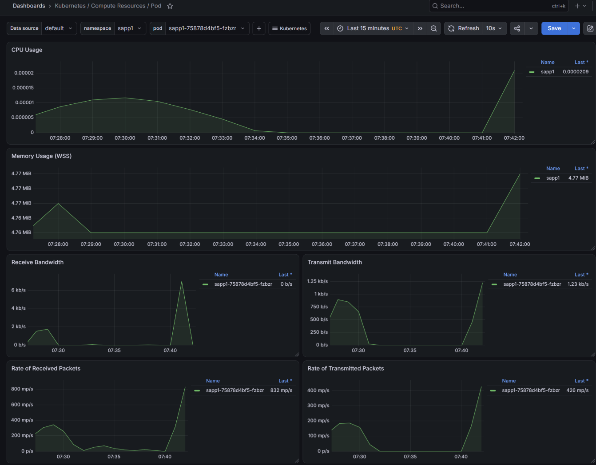